- Let us recall that Garndeners theory of multipple intelligences is as follows:
	
	- That intelligence is simply the ability to solve problems or create produces of value, which may take 8 forms. 
 
		     1. linguistical
		     2. logical-mathematical
			 3. visual-spacial
			 4. bodily-kinesthetic
			 5. musical
			 6. interpersonal
			 7. intrapersonal
			 8. naturalist

- The paper attempts to lay down to foundations to answer 3 unique question.					

	1. do neural functional strucutres and networks share coherance while being conceptually unique to other structures? 
	
	2. does the data describe a conceptual framework for the 8 types of intelligence? 
	
	3. how well do these neural architectures compare with the neural basis for general intelligence? 

- The paper mentions some important regions for research, they include the frontal cortex, temporal cortex, parietal cortex, occipital cortex, cingulate cortex, insular cortex, subcortical regions, and the cerebellum. 

- I will note that this paper is an amalgamation of a bunch of different studies, one regarding interpersonal intelligence showed activation in the frontal cortex, prefrontal cortex, temporal cortex, medial temporal lobe, amygdala, dorsolateral PFC, and the superior temporal sulcus. Other regions included the cingulate cortex, enterior cingulate cortex, and the parietal cortex. 

- Intraperson intelligence had the FC, PFC, dorsomedial PFC, and lateral PFC. Other notable regions were the cingulate cortex, anterior cingulate cortex, medial temporal lobe, amygdala, anterior temporal cortex, basal ganglia, and brain stem. 

 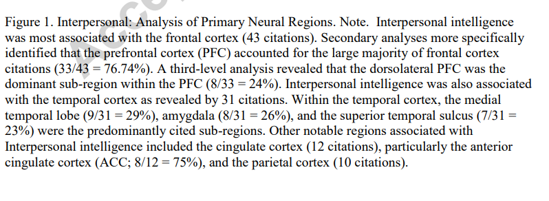

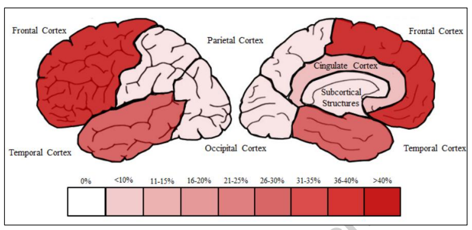

- Visual-spacial had the FC, PFC, premotor cortex, primary motor cortex, dorsolateral PC, partial cortex, parietal cortex, intraparietal sulcus, superior parietal lobule, and the precuneus. Other notable regions were the medial temporal lobe, hippocampus, and the occipital cortex. 

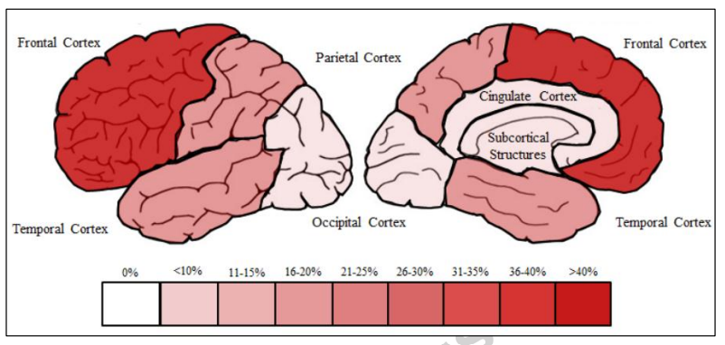

- Naturalist had the temporal cortex, anterior temporal sulcus, and amygdala. The brain stem and basal ganglia were also noted. 

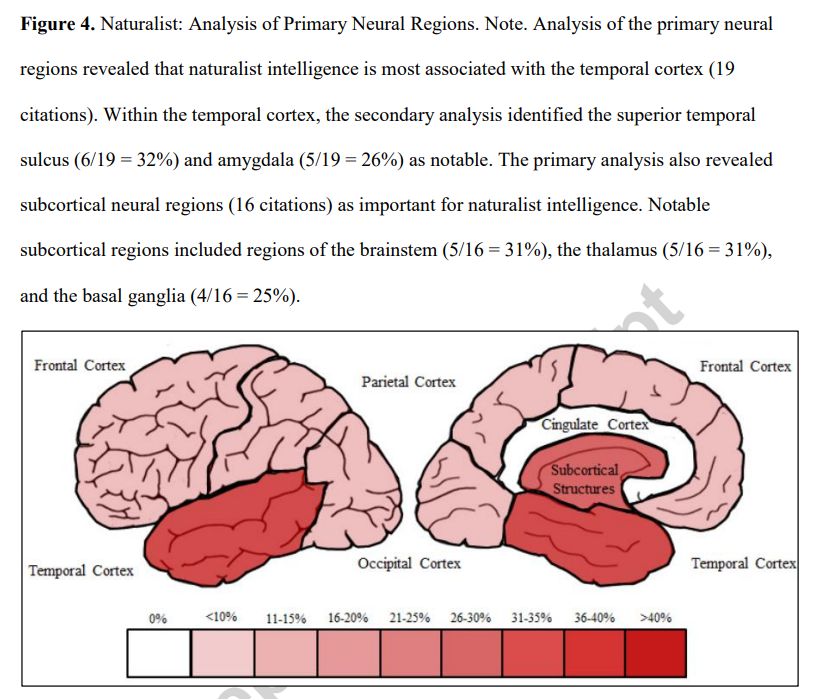

 Musical had the FC, motor cortex, and pre motor cortex. The temporal cortex and superor temporal gyrus were also noted. Basal ganlgia and auditory cortex were also mentioned. 

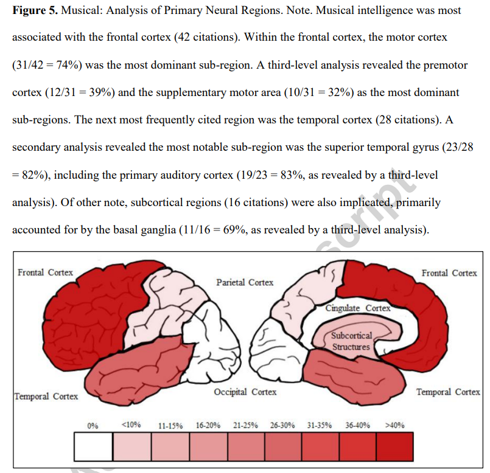

- Kinestetic had the FC, motor cortex, primary motor cortex, premotor cortex, parietal cortex, basal ganglia, thalamus, and the cerebellum. 

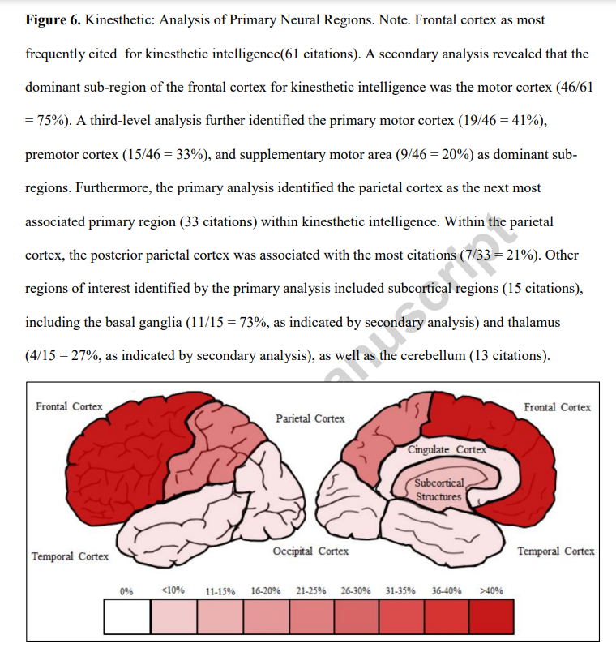

- Linguistic had the temporal cortex, superior temporal gyrus, FC, inferior frontal gyrus, motor cortex, parietal cortex and the inferiro parietal lobule 

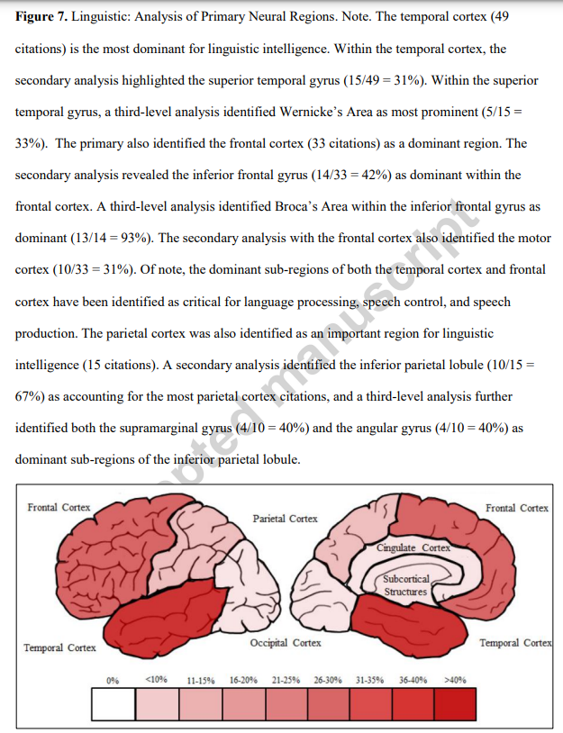

- Logical-mathematical has the FC, PFC, inferior frontal gyrus, dorsolateral PFC, Brocas Area, parietal cortex, interparietal cortex, interparietal sulcus, angular gyrus, parietal lobule, and the precuneus. 

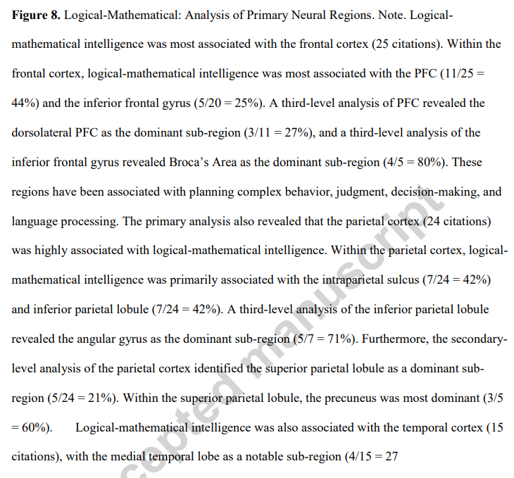

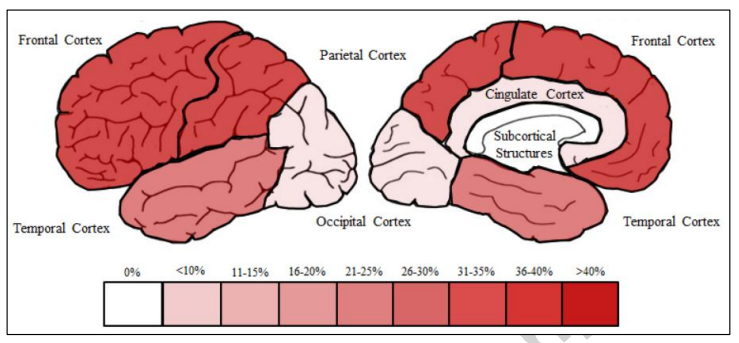

 General intelligence had the FC, parietal cortex, temporal cortex, cingulate cortex, occipital cortex, and cerebellum. I will add that the paper noted that general intelligence and logical-mathematical intelligence depended heavily on planning, complex reasoning, mental visualization, verbal comprehension, and judgement. The paper also had the PFC, inferior frontal gyrus, inferior parietal lobal, superior temporal gyrus, and anterior cingulat cortex. 

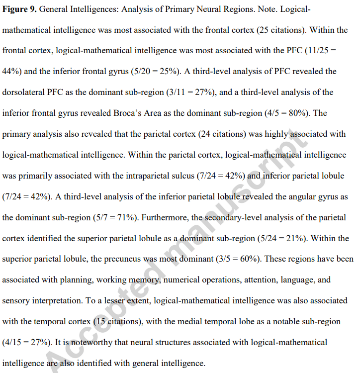

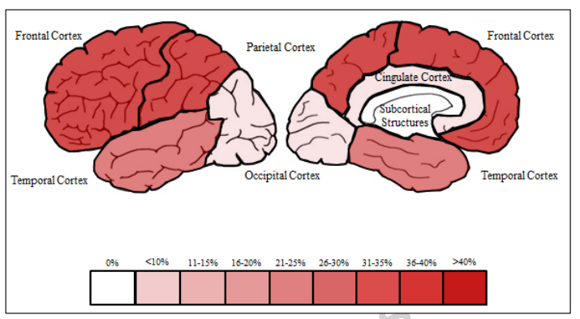

- I will note that the paper organized these regions according to different levels on analysis and sorting them in accordance to the number of citations that each region revieved. 

- P-FIT is a commonly accepted neural model for general intelligence. 

- The paper states that there is suffecient evidence to support the claim that there are unique nerual structures for each of the 8 structures whilst them also sharing commonalities. 

- I will note an important excerpt from the paper located in the *Dicussion* section of the paper
	
		A detailed examination of three levels of neural analysis was employed in this review: primary, sub-regions and particular structures within sub-regions. The primary neural region analysis divided the brain into eight large neural regions (i.e., frontal cortex, parietal cortex, temporal cortex, occipital cortex, cingulate cortex, insular cortex, cerebellum, and subcortical structures) most frequently cited in the literature. Six of the eight intelligences were most associated with the frontal cortex, while the other two intelligences revealed the temporal cortex as most dominant (see Table 12). The parietal and cingulate cortices were the next most frequently associated with the intelligences. Alternatively, the cerebellum and insular cortex were never ranked within the top three most associated neural regions for any of the eight intelligences.